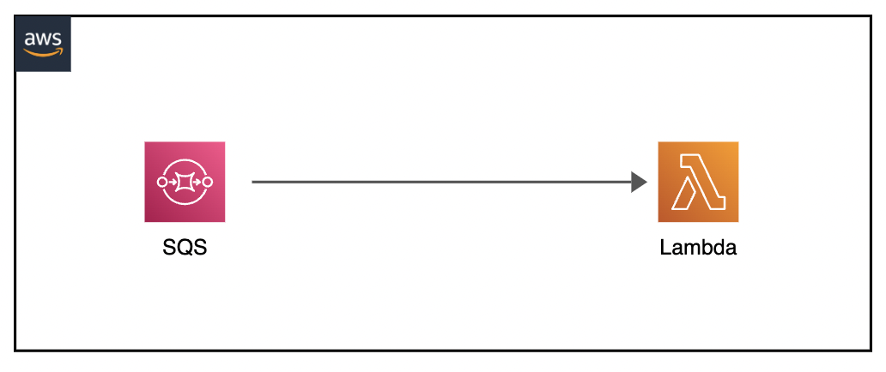

# Nodejs AWS SAM SQS Lambda  &middot; 

Descripción del proyecto: Proyecto de infraestructura como código utilizando el framework AWS SAM para el desarrollo y despliegue de SQS y Lambda. Se utiliza template de desarrollo para agilizar el proceso

## Arquitectura a desplegar



## Acerca de AWS y los servicios utilizados

* https://aws.amazon.com/es/serverless/sam/
* https://aws.amazon.com/es/sqs/
* https://aws.amazon.com/es/lambda/

## Prerequisitos

* Instalación de AWS CLI
  + https://docs.aws.amazon.com/cli/latest/userguide/getting-started-install.html
* Instalación de CLI SAM
  + https://docs.aws.amazon.com/serverless-application-model/latest/developerguide/serverless-sam-cli-install.html
* Credenciales de AWS con políticas de
  + IAMFullAccess
  + AWSCloudFormationFullAccess
  + AmazonSQSFullAccess
  + AWSLambda_FullAccess
  + AmazonS3FullAccess

NOTA: Las políticas entregadas son a efectos de velocidad, se recomienda realizar una descomposición por temas de seguridad
## Configuración de credenciales

Ejecutar comando de configuración de AWS CLI para la ingresar las credenciales

```
aws configure
```

## Validar Yaml

Ejecutar comando

```
sam validate
```

## Preparar proyecto para despliegue

Ejecutar comando

```
sam build
```

## Desplegar proyecto en AWS

Para desplegar aplicación en AWS ejecutar

```
sam deploy
```
NOTA: Indicar como primera instancia de que las funciones no contendran autorización


## Testing

Utilice la CLI de AWS para enviar un mensaje a la cola de SQS y observe el evento enviado a la función de Lambda

1. Enviar mensaje a SQS:

```
aws sqs send-message --queue-url INGRESAR_URL_SQS --message-body "Test message"
```

2. Obtener  logs de la función Lambda:

```
sam logs -n QueueConsumerFunction --stack-name INGRESAR_NOMBRE_STACK
```

## Eliminar aplicación AWS Cloud Formation

```
sam delete
```

## Equipo

Desarrollado por Diego Cortés

* dcortes.net@gmail.com